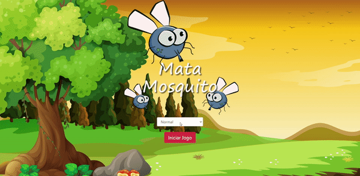

# Mata Mosquitos

A game developed during a course on udemy that can be found [here](https://www.udemy.com/course/web-completo/)

# Used Technologies

> - CSS
> - HTML
> - JavaScript

# Used Frameworks

>- Bootstrap

# Previews

### Responsive

# Considerations

## The original project had only the base game, I added:

> - Responsiveness for mobile and tablets
> - Effect when you kill the fly
> - Score
> - Total count of how many flies you killed in the end of the game
